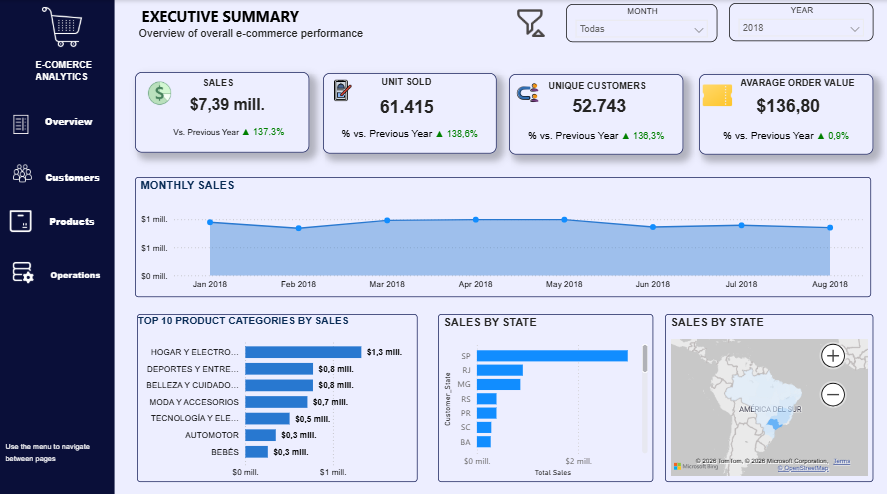
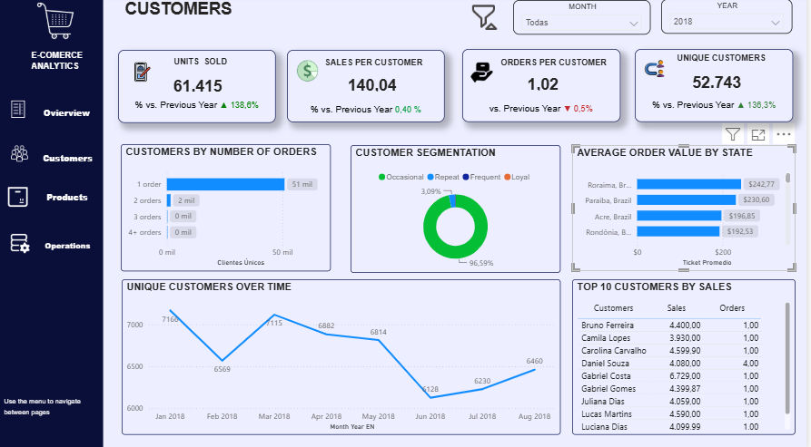
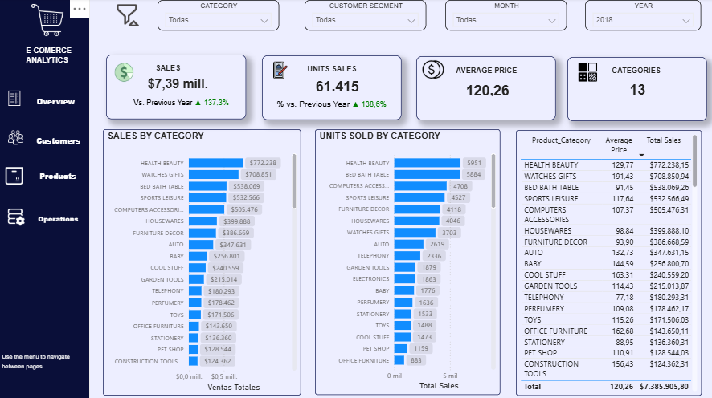
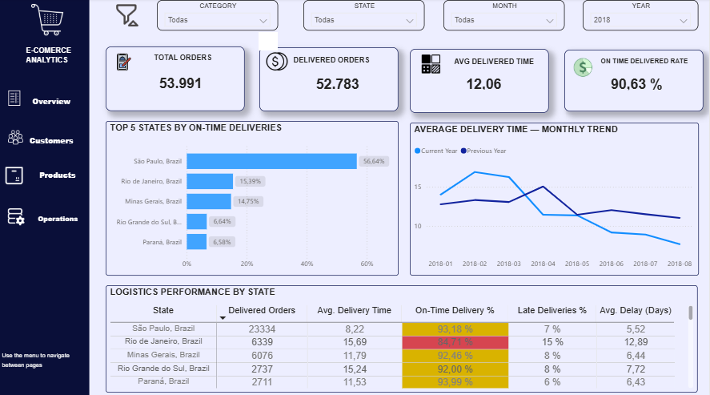

# Olist E-commerce Analytics

[Versión en español](README_ES.md)

End-to-end business intelligence project built with the public Brazilian Olist e-commerce dataset. The project covers CSV ingestion with Python, relational modeling in SQL Server, business metrics with DAX, and an interactive Power BI dashboard.



## Project objective

Analyze commercial performance, customer behavior, product categories, and delivery operations to answer four core questions:

- How did sales, orders, customers, and average order value evolve?
- Which product categories generated the highest revenue and volume?
- How frequently did customers purchase and how were they distributed geographically?
- How efficient were deliveries across Brazilian states?

## Tools

- **Python:** pandas, SQLAlchemy, and pyodbc for CSV ingestion.
- **SQL Server:** raw tables, staging layer, analytical dimensions, and fact tables.
- **Power BI:** data modeling, DAX measures, time intelligence, navigation, and visualization.
- **GitHub:** project documentation and reproducible code.

## Data pipeline

```text
Olist CSV files
       ↓
Python ingestion
       ↓
SQL Server: dbo → stg → analytics
       ↓
Power BI semantic model
       ↓
Interactive business dashboard
```

The SQL model separates source tables from transformed analytical tables. The main reporting layer includes:

- `analytics.Dim_Customer`
- `analytics.Dim_Product`
- `analytics.Dim_Seller`
- `analytics.Fact_Orders`
- `analytics.Fact_Sales`

## Dashboard pages

### 1. Overview

Executive view of sales, units sold, unique customers, average order value, monthly trends, category performance, and geographic distribution.


### 2. Customers

Customer purchasing frequency, segmentation, geographic performance, monthly evolution, and top customers by sales.



### 3. Products

Revenue and unit analysis by product category, including category ranking, average price, and total sales.



### 4. Operations

Delivery performance by state, delivered orders, average delivery time, on-time delivery rate, late deliveries, and year-over-year trends.



## Business findings

For the selected 2018 dashboard view:

- **Customer retention is the main commercial opportunity.** Approximately 96.6% of customers belong to the occasional segment, showing that acquisition volume is high but repeat purchasing is limited.
- **Revenue is concentrated in a small group of categories.** Health & Beauty and Watches & Gifts lead both sales and unit volume, making them key categories for assortment, pricing, and inventory decisions.
- **São Paulo is the core market.** It leads customer activity, sales, and on-time deliveries, revealing a strong geographic concentration of the business.
- **Delivery performance is positive overall but uneven across states.** The on-time delivery rate is approximately 90.6%, while Rio de Janeiro shows a lower rate and longer average delivery time than the leading states.
- **Logistics improved during 2018.** Average delivery time declined substantially after the first-quarter peak and reached its lowest level toward August.
- The analyzed view totals approximately **R$7.39 million in sales**, **61,415 units**, **52,743 unique customers**, and an average order value of **R$136.80**.

September and October were excluded from the report to maintain a consistent comparison period.

## Repository structure

```text
olist-ecommerce-analytics/
├── dashboard/
│   └── Olist_Ecommerce_Analytics.pbix
├── docs/
├── images/
│   ├── 01_overview.png
│   ├── 02_customers.png
│   ├── 03_products.png
│   └── 04_operations.png
├── python/
│   ├── load_olist_to_sql.py
│   └── requirements.txt
├── sql/
│   └── 01_database_schema.sql
├── README.md
└── README_ES.md
```

## Reproducing the ingestion layer

1. Download the public Olist dataset.
2. Create the SQL Server structure using `sql/01_database_schema.sql`.
3. Install the Python dependencies:

```bash
pip install -r python/requirements.txt
```

4. Load the original CSV files into SQL Server:

```bash
python python/load_olist_to_sql.py \
  --data-dir "path/to/olist" \
  --server "localhost\\SQLEXPRESS"
```

The loader uses Windows authentication and keeps connection details outside the repository.

## Data source

Public Brazilian e-commerce dataset by Olist, available on Kaggle.

## Author

**Andrés Impollino**  
Data & Economic Analyst | SQL · Python · Power BI
